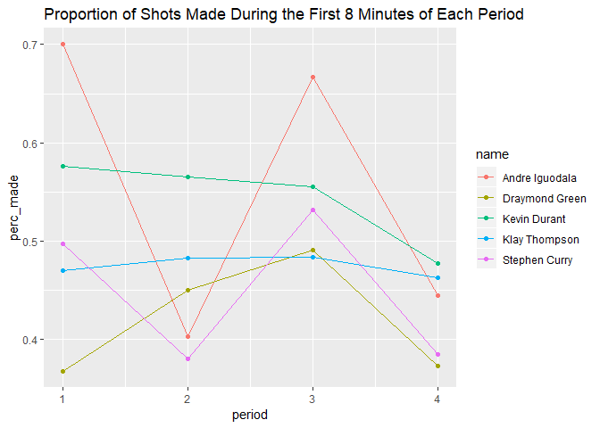

Workout 01
================
Ana Comesana

``` r
library(dplyr)
```

    ## Warning: package 'dplyr' was built under R version 3.4.4

    ## 
    ## Attaching package: 'dplyr'

    ## The following objects are masked from 'package:stats':
    ## 
    ##     filter, lag

    ## The following objects are masked from 'package:base':
    ## 
    ##     intersect, setdiff, setequal, union

``` r
library(ggplot2)
```

    ## Warning: package 'ggplot2' was built under R version 3.4.4

Report
======


Introduction
------------

The Golden State Warriors are without a doubt one of the top NBA teams at the moment, but which player within the team is the true "cream of the crop"? To find this, I will look at the proportion of shots made, and what type of shots in relation to how much of the period has passed. This report attempts to analyze the performance of Golden State Warriors Andre Iguodala, Draymond Green, Kevin Durant, Klay Thompson and Stephen Curry by looking at the proportion of shots they are able to make and how it changes as the game goes on.

Motivation
----------

Making shots throughout the game is what every basketball player is paid to do, but which Golden State Warrior player can make the higher proportion of shots in the last couple of minutes of each period? What truly separates a good athlete from a great one is the ability to keep their calm and perform when the pressure is on- usually the last minutes of each period, when the counter is going down and the buzzer about to go off. This offers a good measure of how good a player is, their performance when stressed and tired.

Background
----------

Below are some basic statistics relating to this report:

1.  2 Point Effective Shooting Percentage by Player:

<!-- -->

    ## # A tibble: 5 x 4
    ##   name           total  made perc_made
    ##   <fct>          <int> <int>     <dbl>
    ## 1 Andre Iguodala   210   134     0.638
    ## 2 Kevin Durant     643   390     0.607
    ## 3 Stephen Curry    563   304     0.540
    ## 4 Klay Thompson    640   329     0.514
    ## 5 Draymond Green   346   171     0.494

1.  3 Point Effective Shooting Percentage by Player:

<!-- -->

    ## # A tibble: 5 x 4
    ##   name           total  made perc_made
    ##   <fct>          <int> <int>     <dbl>
    ## 1 Klay Thompson    580   246     0.424
    ## 2 Stephen Curry    687   280     0.408
    ## 3 Kevin Durant     272   105     0.386
    ## 4 Andre Iguodala   161    58     0.360
    ## 5 Draymond Green   232    74     0.319

1.  Overall Effective Shooting Percentage by Player:

<!-- -->

    ## # A tibble: 5 x 4
    ##   name           total  made perc_made
    ##   <fct>          <int> <int>     <dbl>
    ## 1 Kevin Durant     915   495     0.541
    ## 2 Andre Iguodala   371   192     0.518
    ## 3 Klay Thompson   1220   575     0.471
    ## 4 Stephen Curry   1250   584     0.467
    ## 5 Draymond Green   578   245     0.424

The previous statistics show that Kevin Durant is the player who makes the highest percentage of overall shots, followed by Iguodala only 3% behind him. We see that overall there is a higher proportion of 2 pionters made than 3 pinters (which makes sense), and that Klay Thompson and Stephen Curry are the two players who are able to make the highest proportion of 3 pointers, while Andre Iguodala and Kevin Durant lead the pack for proportion of 2 pointers made. Overall, there is no one player that stands out most when we analyze these statistics, which is why this report hopes to offer some sort of distinction as to who the better athlete is.

Data
----

First, let's include some shot charts for the players: 

We will look at the proportion of shots made in the first 8 minutes of each period, and compare it to the proportion of shots made in the last 4 minutes (last third) of the period.

The following data shows the proportion of shots made by our players during the first 8 minutes of each period:

    ## # A tibble: 20 x 5
    ## # Groups:   name [5]
    ##    name           period total  made perc_made
    ##    <fct>           <int> <int> <int>     <dbl>
    ##  1 Andre Iguodala      1    10     7     0.7  
    ##  2 Andre Iguodala      2    62    25     0.403
    ##  3 Andre Iguodala      3    15    10     0.667
    ##  4 Andre Iguodala      4    72    32     0.444
    ##  5 Draymond Green      1   125    46     0.368
    ##  6 Draymond Green      2    60    27     0.45 
    ##  7 Draymond Green      3   108    53     0.491
    ##  8 Draymond Green      4    59    22     0.373
    ##  9 Kevin Durant        1   170    98     0.576
    ## 10 Kevin Durant        2   122    69     0.566
    ## 11 Kevin Durant        3   173    96     0.555
    ## 12 Kevin Durant        4   111    53     0.477
    ## 13 Klay Thompson       1   266   125     0.470
    ## 14 Klay Thompson       2   201    97     0.483
    ## 15 Klay Thompson       3   244   118     0.484
    ## 16 Klay Thompson       4   177    82     0.463
    ## 17 Stephen Curry       1   201   100     0.498
    ## 18 Stephen Curry       2    50    19     0.38 
    ## 19 Stephen Curry       3   205   109     0.532
    ## 20 Stephen Curry       4    65    25     0.385

This graph offers an easier way to visualize the data:



Likewise, here is the table and plot for the porpotion of shots made during the last 4 minutes of each period:

    ## # A tibble: 20 x 5
    ## # Groups:   name [5]
    ##    name           period total  made perc_made
    ##    <fct>           <int> <int> <int>     <dbl>
    ##  1 Andre Iguodala      1    71    43     0.606
    ##  2 Andre Iguodala      2    49    28     0.571
    ##  3 Andre Iguodala      3    70    36     0.514
    ##  4 Andre Iguodala      4    22    11     0.5  
    ##  5 Draymond Green      1    56    21     0.375
    ##  6 Draymond Green      2    75    44     0.587
    ##  7 Draymond Green      3    46    13     0.283
    ##  8 Draymond Green      4    49    19     0.388
    ##  9 Kevin Durant        1    91    45     0.495
    ## 10 Kevin Durant        2   129    75     0.581
    ## 11 Kevin Durant        3    61    28     0.459
    ## 12 Kevin Durant        4    58    31     0.534
    ## 13 Klay Thompson       1    74    36     0.486
    ## 14 Klay Thompson       2   127    60     0.472
    ## 15 Klay Thompson       3    70    33     0.471
    ## 16 Klay Thompson       4    61    24     0.393
    ## 17 Stephen Curry       1   202    85     0.421
    ## 18 Stephen Curry       2   191    83     0.435
    ## 19 Stephen Curry       3   223   108     0.484
    ## 20 Stephen Curry       4   113    55     0.487


For easier analysis, I have combined these two tables and plots below: 

Analysis and Discussion
-----------------------

From the following plots, we can see that Iguodala outperforms every other player in the first period, with his percentage of shots made for both the first 8 minutes and last 4 minutes being higher than anyone else's, although Kevin Durant is a close second. Kevin Durant seems to outperform his peers during the 2nd period, both during the first 8 minutes and last 4 minutes. Draymond Green has the most interesting 3rd period, with a highly variable performance. During the last 4 minutes, the percentage of shots he is able to make drops by 40%, the biggest gap visible in these plots. Thompson seems to be the only player who does worse during the last 4 minutes of the 4th period than during the first 8 minutes. This may be due to the fact that fatigue may hit him harder than the other players.

It is interesting to note a trend in Draymond Green and Kevin Durant and Andre Iguodala's overall performance. Their performances during the first 8 minutes and last 4 minutes of any given period seem to "balance" each other out. If they do relatively well during the first 8 minutes, like Draymond Green in the 3rd period, their performance is lacking during the last 4 minutes.Likewise, Andre Iguodala's performance seemed to be lacking on average during the first 8 minutes of the 2nd period, but it vastly differs to his performance during the last 4 mintues of the period, this could be because he starts the period usually fairly tired but tries to make it up at the end.

Overall, we can see that Stephen Curry's performance during the last 4 minutes of the period improves as we get further ino the game, a trend that no other player has. This could indicate that Curry is indeed an athlete who is able to keep his head calm during difficult situations and who outperforms himself in situations of stress. In contrast, Thompson's performance during the last 4 minutes of the game gets worse, with his overall lowest percentage of shots made being during the last 4 minutes of the 4th period. Andre Iguodala has a similar trend as well, with an up to 20% difference in percentage of shots made during the last 4 minutes of the first and last periods.

Conclusion
----------

Overall, I would agree with popular belief on Stephen Curry being the best athlete out of the players we analyzed. Not only is his performance better during the last 4 minutes of each period, showing that he is able to keep his head calm under pressure and perform better than he has during the rest of the period. His performance also increases as it get later in the game, with a higher percentage of shots being made during the last 4 minutes of the last period than at almost any other time during the game.
